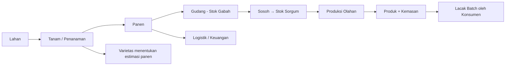
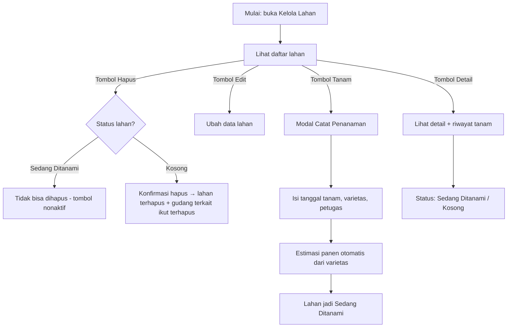
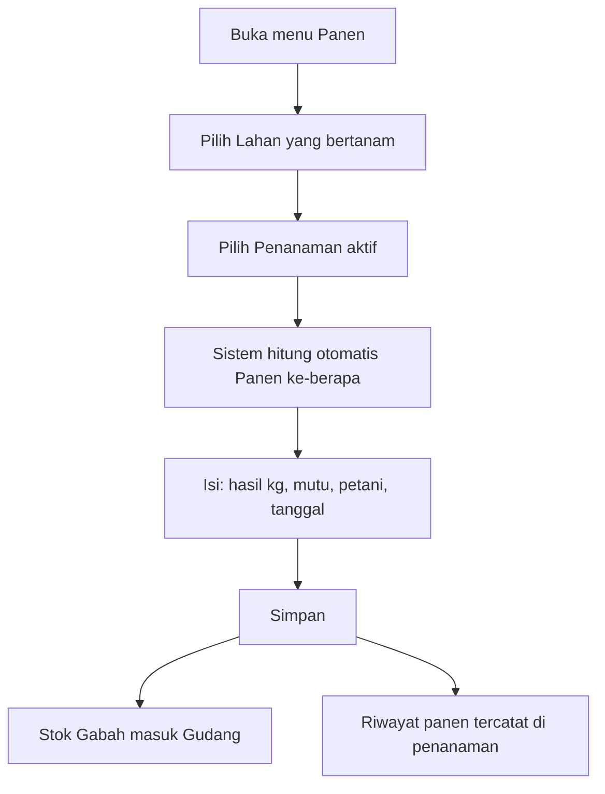
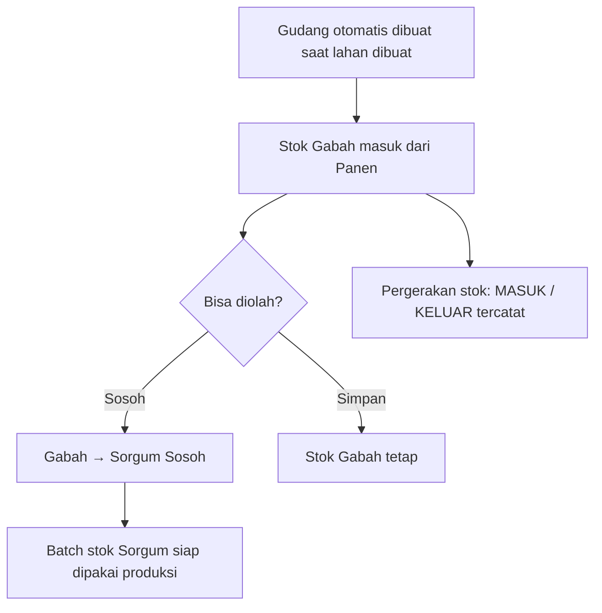
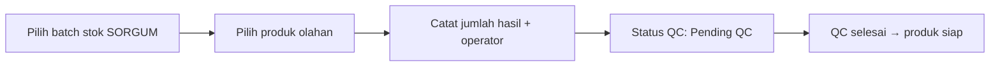
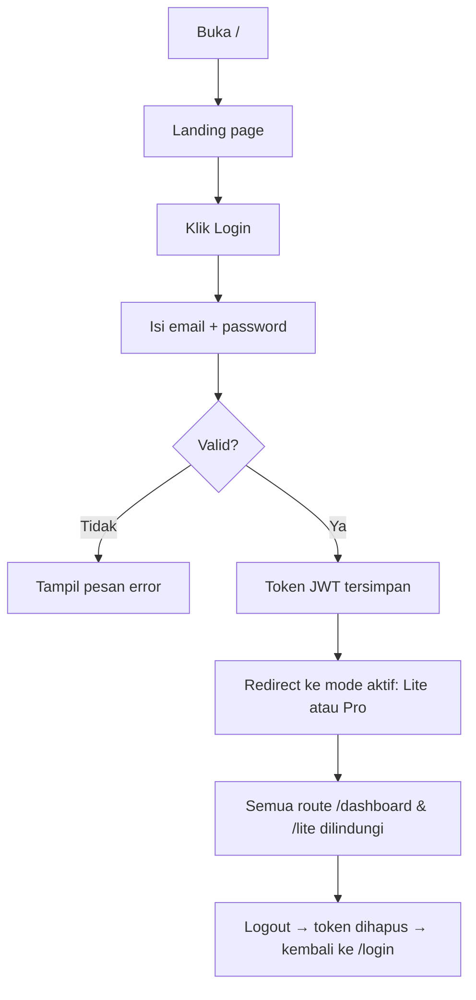
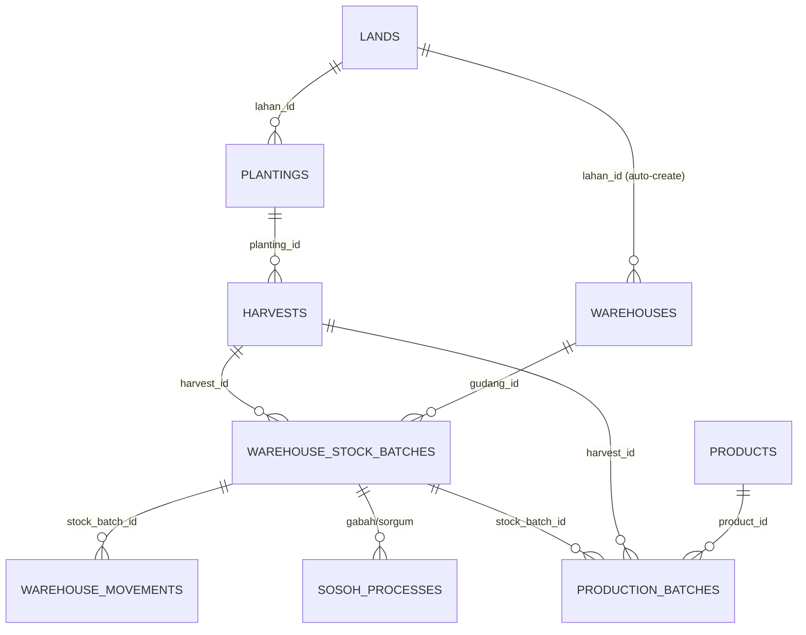

# 📋 Daftar Fitur & Alur Aplikasi — Sorgum SCM

> **Sorgum SCM** = Sistem Manajemen Rantai Pasok Sorgum untuk **Kelompok Wanita Tani (KWT)**.
> Aplikasi web yang mendampingi pengelolaan dari **lahan → tanam → panen → gudang → olahan → produk**,
> plus administrasi pendukung (sertifikat, kemasan, peralatan, logistik/keuangan, varietas).

Dokumen ini merangkum **fitur** dan **alur (flow)** utama aplikasi berdasarkan implementasi di `src/` dan `backend-api/`.

---

## 1. Ringkasan Aplikasi

| Aspek | Keterangan |
|---|---|
| Jenis aplikasi | Web app (React + Vite + TypeScript + Tailwind) dengan backend API (Node/Express + MySQL) |
| Pengguna utama | Admin KWT (single-user) + pengunjung landing page & halaman lacak |
| Dua mode tampilan | **Mode Mudah (Lite)** & **Mode Lengkap (Pro)** — bisa diganti dari dalam aplikasi |
| Bahasa UI | Indonesia sederhana (target pengguna ibu-ibu KWT) |
| Halaman publik | Landing page, Login, Lacak Batch (traceability) |
| Autentikasi | Login email/password (JWT 7 hari), admin tunggal |

---

## 2. Mode Tampilan

Aplikasi punya **2 mode** yang disimpan di `localStorage` (`app_mode`), default **Mode Mudah (lite)**:

| Mode | Path | Target | Ciri |
|---|---|---|---|
| 🟢 **Mode Mudah / Lite** | `/lite/*` | Ibu-ibu KWT (pengguna harian) | Menu sederhana: Dashboard, Lahan, Panen, Gudang, Produksi, Produk, Varietas, Profil. Tampilan ringkas, langkah dipandu. |
| 🟣 **Mode Lengkap / Pro** | `/dashboard/*` | Admin/pengelola lengkap | Menu lengkap + kelola master (varietas, produk olahan), sertifikat, kemasan, logistik, CMS. |

> Kedua mode memakai **data yang sama** (satu database). Mode hanya mengubah cara tampil & kedalaman menu.

---

## 3. Peta Halaman & Fitur

### 3.1 Halaman Publik (tanpa login)

| Route | Halaman | Fitur |
|---|---|---|
| `/` | Landing Page | Profil KWT, keunggulan, produk, galeri, kontak — **semua konten bisa diubah lewat CMS** |
| `/login` | Login | Masuk dengan email + password (demo: `admin@sorgum.com` / `password`) |
| `/trace/:kodeBatchStok` | **Lacak Batch** (publik) | Konsumen bisa melacak asal-usul produk dari **kode batch stok** — melihat riwayat: batch → gudang → lahan → tanam → panen → proses produksi → logistik |

### 3.2 Mode Lengkap (Admin) — `/dashboard/*`

Sidebar 11 menu:

| # | Menu | Route | Fungsi inti |
|---|---|---|---|
| 1 | **Dashboard** | `/dashboard` | Ringkasan metrik: lahan, penanaman aktif, hasil panen, stok gudang, batch olahan, sertifikat, pengeluaran bulan ini, kemasan menipis |
| 2 | **Kelola Lahan & Tanaman** | `/dashboard/lahan` | CRUD lahan (dengan peta), catat penanaman per lahan, riwayat tanam, status lahan otomatis (Sedang Ditanami / Kosong), proteksi hapus lahan aktif |
| 3 | **Panen** | `/dashboard/panen` | Catat hasil panen dari penanaman aktif, panen ke-1/2/3, otomatis masuk gudang |
| 4 | **Gudang** | `/dashboard/gudang` | Kelola gudang, stok gabah & sorgum per gudang, batch stok, pergerakan masuk/keluar, sosoh (gabah→sorgum) |
| 5 | **Sarana & Peralatan** | `/dashboard/peralatan` | CRUD alat, kondisi & status pemakaian |
| 6 | **Kelola Olahan** | `/dashboard/produksi` | Produksi olahan (tepung, dll.) dari batch stok sorgum, status QC |
| 7 | **Kelola Sertifikat** | `/dashboard/sertifikat` | CRUD dokumen sertifikat (organik, halal, dll.) |
| 8 | **Kelola Data Kemasan** | `/dashboard/kemasan` | CRUD bahan kemasan + stok menipis/habis |
| 9 | **Logistik** | `/dashboard/logistik` | Pencatatan transaksi keuangan logistik + ekspor |
| 10 | **Varietas Sorgum** | `/dashboard/master/varietas` | Master data varietas (nama, lama panen, dll.) |
| 11 | **Produk Olahan** | `/dashboard/master/produk` | Master produk olahan |

Halaman tersembunyi (via URL, tidak di sidebar):
- `/dashboard/cms` — **CMS konten landing page** (9 tab)
- `/dashboard/profil` — Profil admin, foto avatar, ganti password
- `/dashboard/integrasi` → redirect ke `/dashboard/cms`

### 3.3 Mode Mudah (Lite) — `/lite/*`

| Menu | Route | Fungsi |
|---|---|---|
| Dashboard | `/lite` | Ringkasan sederhana |
| Lahan | `/lite/lahan` | Lihat lahan + status tanam + catat tanam |
| Panen | `/lite/panen` | Catat panen (pilih lahan bertanam) |
| Gudang | `/lite/gudang` | Lihat stok sederhana |
| Produksi | `/lite/produksi` | Proses olahan sederhana |
| Produk | `/lite/produk` | Lihat produk olahan |
| Varietas | `/lite/varietas` | Lihat varietas |
| Profil | `/lite/profil` | Profil & password |

---

## 4. Alur Utama (End-to-End)

### 4.1 Alur Inti Rantai Pasok



**Penjelasan singkat setiap tahap:**

1. **Lahan** — Daftar blok lahan milik KWT (luas, lokasi desa, pengelola, foto, titik peta).
2. **Tanam (Penanaman)** — Pilih lahan → catat tanggal tanam, varietas, petugas, jumlah lubang.
   Estimasi panen dihitung otomatis dari `tanggal tanam + lama panen varietas`.
   Status lahan otomatis menjadi **"Sedang Ditanami"**.
3. **Panen** — Pilih penanaman yang aktif → catat hasil (kg), mutu, petani. Bisa panen **ke-1, ke-2, ke-3**.
   Hasil panen otomatis menjadi **stok gabah di gudang**.
4. **Gudang** — Stok gabah & sorgum dikelola per gudang. Gabah bisa **disosoh** menjadi sorgum sosoh.
5. **Produksi** — Batch stok sorgum dipakai jadi bahan baku olahan (mis. tepung sorgum). Ada status QC.
6. **Produk & Kemasan** — Produk olahan dicatat dengan kemasannya.
7. **Lacak Batch** — Setiap batch stok punya kode unik yang bisa dilacak publik: dari produk sampai ke lahan asalnya.

### 4.2 Alur Detail — Kelola Lahan & Tanaman



**Aturan penting:**
- Status lahan **tidak diinput manual** — dihitung otomatis dari penanaman aktif (`Ditanam` / `Tumbuh` / `Siap Panen`).
- Lahan yang **sedang ditanami tidak bisa dihapus** (backend tolak 409 + tombol hapus nonaktif).
- Saat lahan kosong dihapus, **riwayat tanam & gudang auto-create ikut dibersihkan** agar tidak ada data menggantung.

### 4.3 Alur Detail — Panen



- Panen hanya bisa dari **lahan yang sedang ditanami** (status aktif).
- Mendukung **beberapa kali panen** (ke-1/2/3) dari satu penanaman.

### 4.4 Alur Detail — Gudang & Stok



- Setiap gudang menyimpan **batch stok** (kode unik, jumlah masuk, sisa).
- Ada **riwayat pergerakan** (masuk/keluar) per batch.
- Jenis stok: **GABAH** (mentah) & **SORGUM** (sosoh).

### 4.5 Alur Detail — Produksi Olahan



- Bahan baku diambil dari **stok sorgum** yang tersedia (bisa lintas gudang).
- Hasil produksi tercatat sebagai batch produk olahan.

### 4.6 Alur Autentikasi



---

## 5. Relasi Data (Ringkas)



Tabel utama backend: `users`, `cms_settings`, `lands`, `plantings`, `harvests`, `warehouses`, `warehouse_stock_batches`, `warehouse_movements`, `sosoh_processes`, `production_batches`, `products`, `varieties`, `equipment`, `certificates`, `packaging_materials`, `logistics_expenses`, `notifications`, `api_keys`.

> Catatan: kolom relasi (`lahan_id`, `planting_id`, dst.) adalah **index biasa, bukan foreign key constraint** — pembersihan data menggantung (orphan) dijaga lewat logika aplikasi.

---

## 6. Fitur Administrasi Pendukung

### Sertifikat
- Simpan dokumen legalitas/mutu (organik, halal, dsb.) dengan status aktif/kadaluarsa.
- Dashboard menampilkan jumlah sertifikat aktif.

### Kemasan
- Kelola stok bahan kemasan; deteksi **menipis / habis**.
- Dashboard menampilkan jenis kemasan yang perlu perhatian.

### Peralatan (Sarana)
- Catat alat, kondisi (baik/rusak), status pemakaian (tersedia/dipakai/dirawat).

### Logistik & Keuangan
- Catat transaksi (pemasukan/pengeluaran) logistik.
- Dashboard menghitung **pengeluaran bulan berjalan**.
- Bisa ekspor data (CSV/Excel/PDF).

### Varietas & Produk (Master)
- **Varietas**: nama varietas, lama panen (dipakai menghitung estimasi panen).
- **Produk olahan**: daftar produk yang bisa diproduksi.

### CMS Landing Page
- Ubah konten landing (hero, tentang, produk, galeri, kontak) lewat `/dashboard/cms` — tersimpan di backend + cache lokal.

### Profil
- Ubah data profil, **foto avatar** (base64), ganti password.

---

## 7. Fitur Proteksi & Keamanan Data (Penting)

1. **Lahan aktif tanam tidak bisa dihapus** — dilindungi di UI (tombol nonaktif) dan backend (HTTP 409).
2. **Penghapusan berantai aman** — saat entitas induk dihapus, referensi anak dibersihkan/dikosongkan (mis. hapus lahan → gudang auto-create ikut hapus; referensi panen/produksi diputus).
3. **Input angka** memakai string agar mudah diedit; konversi saat simpan.
4. **Notifikasi via Toast** (bukan `alert()`).
5. **Route admin dilindungi** `ProtectedRoute`; token JWT disimpan di localStorage.
6. **Peta**: Google Maps hanya render; pencarian alamat pakai Nominatim (OpenStreetMap) — tidak memicu billing.

---

## 8. Cara Menjalankan (Ringkas)

```bash
# Terminal 1 — Frontend (port 3000)
npm install
npm run dev

# Terminal 2 — Backend (port 8000)
cd backend-api
npm install
npm run dev
```

- Frontend: http://localhost:3000
- Backend: http://localhost:8000/api/health
- Login demo: `admin@sorgum.com` / `password`
- Backend otomatis membuat database & tabel saat pertama start.
- Produksi: `https://scm.livinglabs.id`

---

*Dokumen ini disusun berdasarkan kode sumber. Jika ada perubahan fitur, perbarui dokumen ini.*
